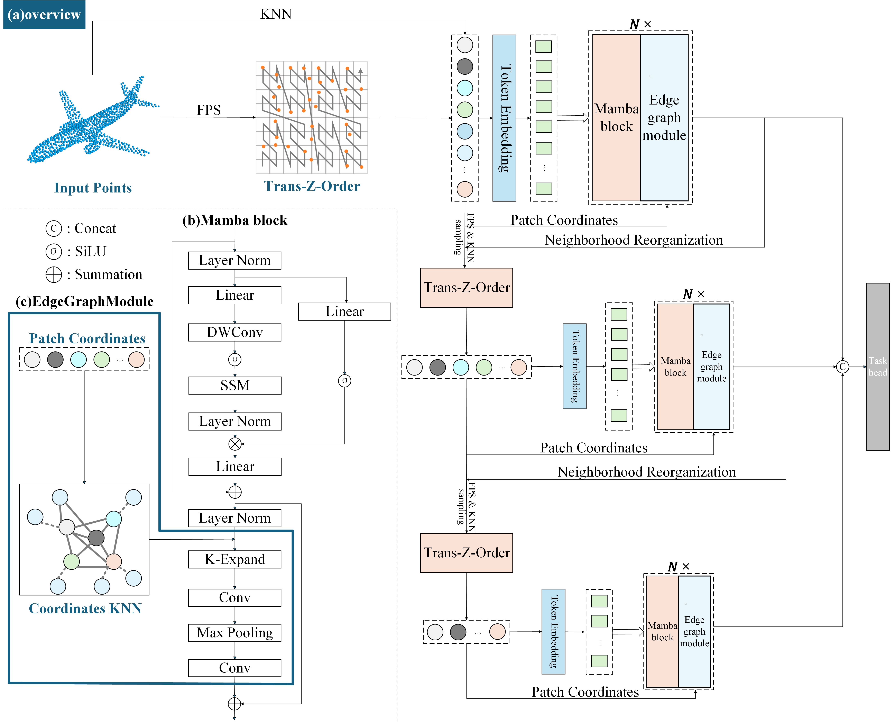

<div align="center">
<h1>PointMSMamba</h1>
<h3>Enhancing Point Cloud Analysis with Multi-scale State Space Modeling and Edge Graph Augmentation</h3>
</div>


## 1. Requirements

Tested on:
PyTorch == 2.1.2;
python == 3.10;
CUDA == 11.8

```
pip install -r requirements.txt
```

```
# Chamfer Distance & emd
cd ./extensions/chamfer_dist
python setup.py install --user
cd ./extensions/emd
python setup.py install --user

# PointNet++
cd ./extensions/pointnet2_ops_lib
python setup.py install --user

# GPU kNN
pip install --upgrade https://github.com/unlimblue/KNN_CUDA/releases/download/0.2/KNN_CUDA-0.2-py3-none-any.whl

# Mamba install
pip install causal-conv1d==1.1.1
pip install mamba-ssm==1.1.1
```

## 2. overview

<div  align="center">    
 
</div>

## 3. Datasets & Pretrained Weights

We use ShapeNet, ScanObjectNN, ModelNet40 and ShapeNetPart in this work. See [DATASET.md](./DATASET.md) for details.

| Dataset             | Pretrain | Acc   | Weight | Logs |
|---------------------|----------|-------|--------|--------|
|ShapeNet             | Point-M2AE | - |[ckpt](https://drive.google.com/file/d/1HVndtEGcKnLl-v1da1NxV3LuA2me9jS8/view?usp=sharing)   |-   |
| ModelNet40          | Point-M2AE | 93.6 | [ckpt](https://drive.google.com/drive/folders/1z_0P1AtMjZykDyPU2Z6Aw2yArv8ClKYe?usp=sharing) | [log](https://drive.google.com/drive/folders/1z_0P1AtMjZykDyPU2Z6Aw2yArv8ClKYe?usp=sharing) |
| ScanObjectNN-objbg | Point-M2AE | 94.15 | [ckpt](https://drive.google.com/drive/folders/1EX9iOQId2ObLbKtXGC2JQTz5UfirAHLJ?usp=sharing) | [log](https://drive.google.com/drive/folders/1EX9iOQId2ObLbKtXGC2JQTz5UfirAHLJ?usp=sharing) |
| ScanObjectNN-objonly | Point-M2AE | 92.94 | [ckpt](https://drive.google.com/drive/folders/14wnIm7WW6K0y85HAolZIxgpm5DMtCN01?usp=sharing) | [log](https://drive.google.com/drive/folders/14wnIm7WW6K0y85HAolZIxgpm5DMtCN01?usp=sharing) |
| ScanObjectNN-hardest| Point-M2AE | 88.72 | [ckpt](https://drive.google.com/drive/folders/1iNWOwV-6IGcS8fIeVGwYZGd0W9Fu6RBV?usp=sharing) | [log](https://drive.google.com/drive/folders/1iNWOwV-6IGcS8fIeVGwYZGd0W9Fu6RBV?usp=sharing) |

## 4. Training from scratch

To train PointMSMamba on ScanObjectNN/Modelnet40 from scratch, run:

```
# Note: change config files for different dataset
bash script/run_scratch.sh
```

## 5. Finetuning
To pre-train PointMSMamba on ShapeNet, run:

```
# Note: change config files for different dataset
bash script/run_pretrain.sh
# or
CUDA_VISIBLE_DEVICES=<GPU> python main.py --config cfgs/pretrain.yaml --exp_name <output_file_name>
```

To fine-tune PointMSMamba on ScanObjectNN/Modelnet40, run:

```
# Note: change config files for different dataset
bash script/run_finetune.sh
```

## 6. Part Segmentation on ShapeNetPart

To train PointMSMamba on ScanObjectNN/Modelnet40 from scratch, run:

```
cd part_segmentation
# Training from scratch.
CUDA_VISIBLE_DEVICES=<GPU> python main.py --config cfgs/config.yaml --log_dir <output_file_name>

# Training from pre-training.
CUDA_VISIBLE_DEVICES=<GPU> python main.py --config cfgs/config.yaml --ckpts <path/to/pre-trained/model> --log_dir <output_file_name>
```

## 7. Citation

If you find this repository useful in your research, please consider giving a star ⭐ and a citation

```bibtex
@article{zhu2025pointmsmamba,
  title={Enhancing Point Cloud Analysis with Multi-scale State Space Modeling and Edge Graph Augmentation},
  author={Zhu, Weidong and Sun, Qi and Luan, Kuifeng and Xie, Qidi and Peng, Bangyu},
  journal={The Visual Computer},
  year={2025},
  publisher={Springer}
}
```

